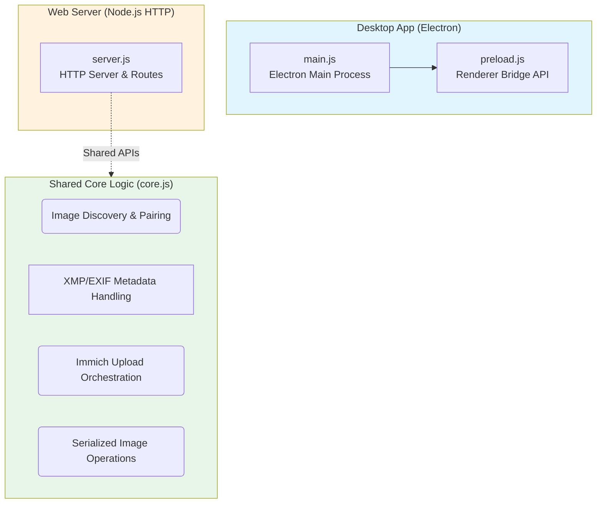
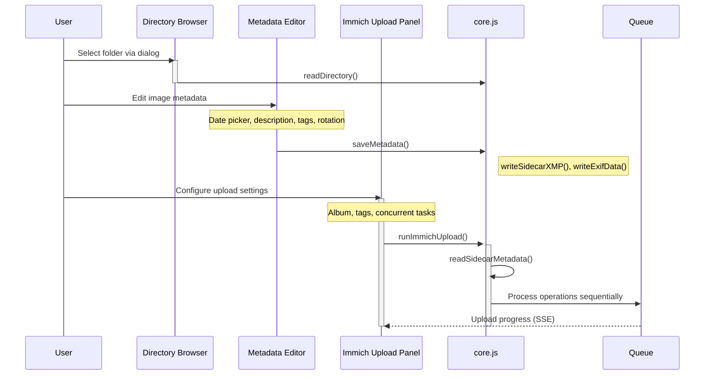

# Image Parser

Image Parser is a desktop and web application for reviewing paired images (A/B side-by-side comparisons), editing metadata (EXIF/XMP sidecars), and uploading image folders to Immich.

## Features

- **A/B Pair Comparison**: Review paired images with A/B side-by-side comparison, supporting common scan naming conventions (`*_a.*` / `*_b.*`, `*_front.*` / `*_back.*`).
- **Metadata Editing**: Edit EXIF dates embedded in image files and XMP sidecar metadata (description, tags, orientation).
- **Immich Upload**: Batch upload paired images to Immich with configurable albums, tags, and concurrent tasks.
- **Image Rotation**: Apply rotation corrections to both file metadata and pixel data where supported.
- **Cross-Platform**: Desktop app for Windows/macOS/Linux via Electron; web server version for TrueNAS/Docker or local deployment.

## Architecture



### Component Interaction Flow



## Desktop Deployment (Electron)

### Prerequisites

- Node.js LTS 20.19+ or 22.12+
- `immich-go` binary installed and available on PATH

### Installation

Double-click `install.bat` (or run `install.bat /nopause` from a terminal). It will:

1. Install Node.js LTS and `immich-go` via `winget` if missing
2. Run `npm install` and `npm run build`
3. Create an **Image Parser** shortcut on your desktop

### Development

```bash
npm run dev   # Start Vite dev server with Electron hot reload
npm start     # Run Electron against existing build
```

The Electron app loads from the built UI in `dist/`. During development, it falls back to the Vite dev server at `http://localhost:5173`.

### Security

Desktop app uses Windows/macOS secure storage to encrypt Immich API keys. Keys are decrypted only in memory and never logged.

## Web Deployment (Node.js HTTP Server)

### Docker / TrueNAS

Create a stack from `docker-compose.yml`. Configure these environment variables:

| Variable                 | Example                      | Purpose                             |
| ------------------------ | ---------------------------- | ----------------------------------- |
| `IMAGEPARSER_PHOTOS_DIR` | `/mnt/tank/photos/scans`     | Photo dataset (mounted at `/data`)  |
| `IMAGEPARSER_CONFIG_DIR` | `/mnt/tank/apps/imageparser` | Settings + encryption key storage   |
| `PUID` / `PGID`          | `568` / `568`                | Owner of the photo dataset          |
| `IMAGEPARSER_PORT`       | `8080`                       | Host port for the web UI            |
| `IMAGEPARSER_USERNAME`   | `admin`                      | Optional HTTP Basic auth user       |
| `IMAGEPARSER_PASSWORD`   | _(strong password)_          | Enables auth when set (recommended) |

Open `http://<truenas-ip>:8080`, click the folder button, and browse the mounted photo share.

### Local Server

Build the app first:

```bash
npm run build
```

Then run with environment variables:

```bash
IMAGEPARSER_ROOT=/path/to/photos \
IMAGEPARSER_CONFIG_DIR=./config \
npm run serve
```

Access at `http://localhost:8080`.

### Security Notes

- The web server only serves files under `/data`; paths outside are rejected.
- No HTTPS is configured in the container; keep it on your LAN or put behind a reverse proxy with TLS.
- API keys are encrypted at rest using AES-256-GCM with per-request authentication.

## Metadata Operations

The shared core logic handles:

- **XMP Sidecars**: Create/update `.xmp` files containing description, tags, EXIF dates, and Adobe Photoshop date fields.
- **Embedded EXIF**: Write creation date directly into image files (`.jpg`, `.tif`, etc.) using ExifTool.
- **Rotation**: Apply orientation to metadata (`Orientation` tag) or rotate pixel data for PNG/WebP formats.

## Testing

Unit tests use Node.js's built-in test runner. Add tests as `*.test.mjs` files:

```bash
npm test
```

The GitHub Actions CI workflow runs tests, ESLint, and the production build on pull requests.

## License

MIT
